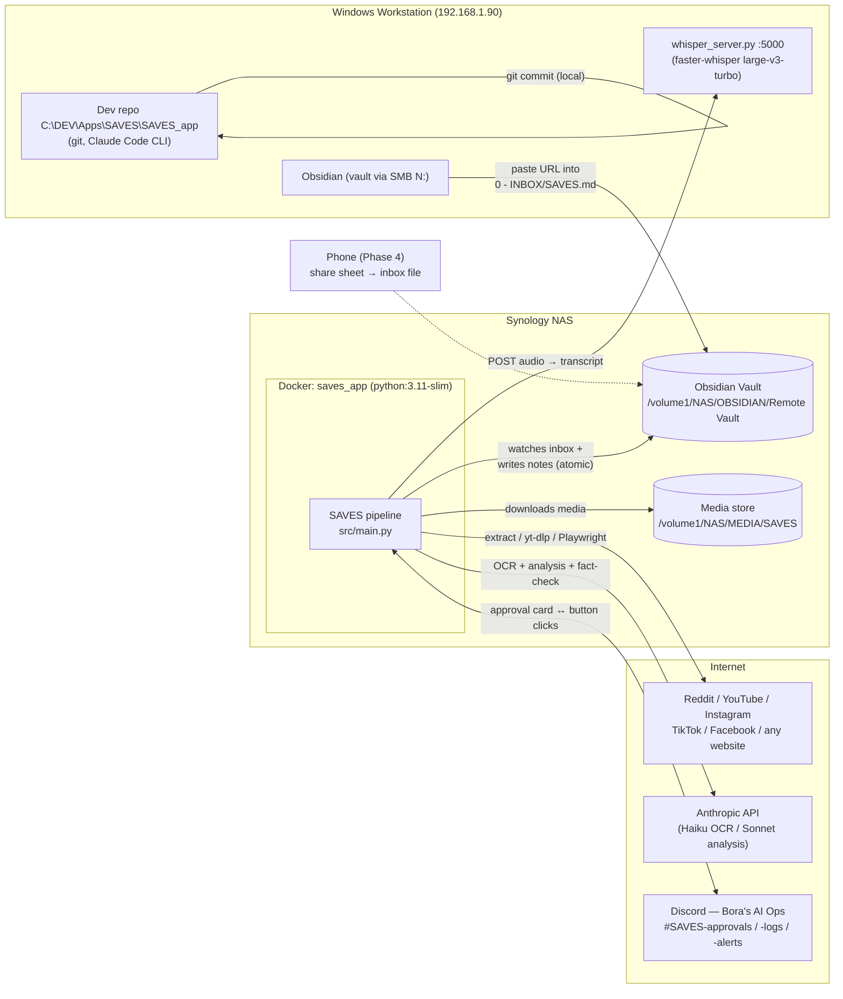
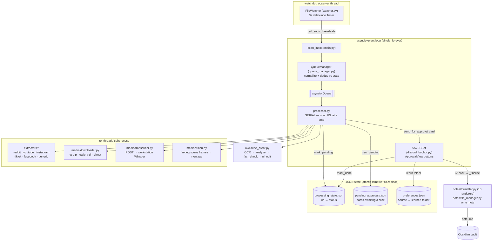
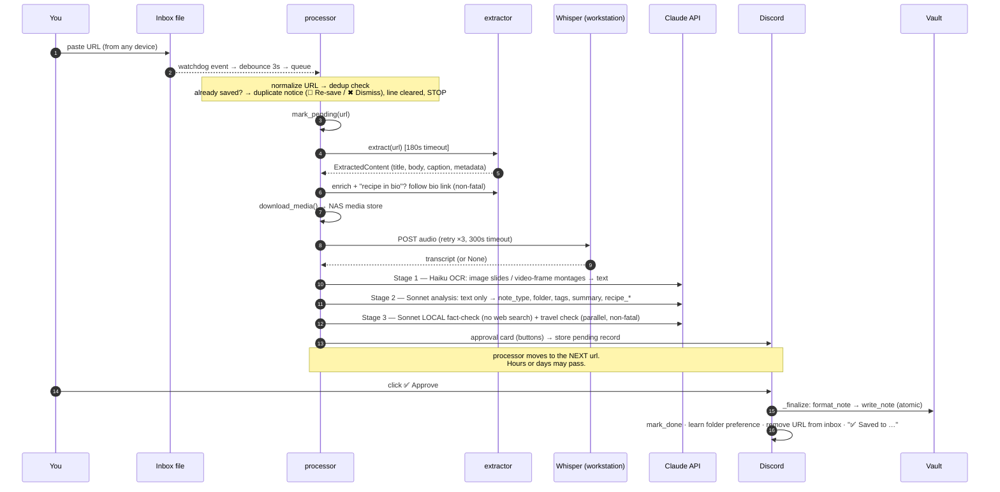
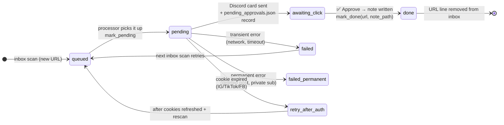

# SAVES — Architecture & Operations Reference

> **What this doc is:** the "how this system is designed and works" reference — diagrams,
> lifecycles, commands, and the knobs you'll actually touch — written to be useful six months
> from now when none of this is fresh.
>
> **Doc map:** `CLAUDE.md` = orientation (auto-loaded each session) · `docs/HANDBOOK.md` =
> recreate & maintain (full config reference in §8, runbook in §9) · `docs/ROADMAP.md` = where
> we are · `docs/PLAN.md` = why decisions were made · `docs/CODE_REVIEW_2026-07-04.md` =
> pre-PROD findings · **this file** = how it's built and how to drive it.
>
> Diagrams are Mermaid — they render on GitHub and in Obsidian; in a terminal read the labels.

---

## 1. Bird's-eye view — the machines and what talks to what

Three physical places: your **Windows workstation** (dev + Whisper + Obsidian), the
**Synology NAS** (the app's real home, in Docker), and **the internet** (content platforms,
Anthropic, Discord). One human surface: Discord on any device.



**The core idea:** you paste a URL into one Markdown file from anywhere; hours later you tap
✅ in Discord and a fully-formed note (media downloaded, transcribed, OCR'd, summarized,
fact-checked, filed into the right folder) exists in your vault. The pipeline never writes a
note without your approval, and it never deletes anything, ever.

---

## 1b. DEV vs PROD — what runs where, and how deployment stays portable

`config.yaml` contains **only canonical container paths** (`/vault`, `/media`, `/app/state`)
that are identical on every deployment. Machine reality is injected per host and never
committed — so moving PROD to a new NAS/server, or spinning up a second environment, is a
matter of filling in one small file:

| | **DEV (today)** | **PROD (target)** | Portable because… |
|---|---|---|---|
| Pipeline app | Workstation, bare Python (`python src\main.py`) | NAS, Docker container | same code, same tracked config |
| Path mapping | `config.local.yaml` overlay (gitignored; deep-merged by `src/config.py`) | `docker/.env` → compose `${VAULT_HOST}`/`${MEDIA_HOST}`/`${STATE_HOST}` mounts | host paths live outside git |
| Vault | local **test vault** `C:/DEV/Apps/SAVES/OBSIDIAN` | real vault `/volume1/NAS/OBSIDIAN/Remote Vault` | notes reference media via `media://` relative paths — device-independent |
| Media | `C:/DEV/Apps/SAVES/MEDIA` | `/volume1/NAS/MEDIA/SAVES` | same |
| State JSONs | repo root | `/volume1/docker/saves/state` (one mounted **directory**) | schema identical; single-file binds are forbidden (os.replace breaks) |
| Whisper | workstation `192.168.1.90:5000` | workstation — possibly a dedicated server later | app only knows `transcription.remote_url`; relocating = one line |
| Secrets | repo-root `.env` | same file, on the NAS | only 2 keys ever |

**Rule:** never run DEV and PROD against the same vault/state simultaneously — two watchers
+ two state writers on one inbox will fight. Today's separate DEV test vault makes this safe.

### PROD go-live: fresh implementation, not a migration

There is almost nothing to migrate — the real vault and media store already live on the NAS,
and DEV's state describes a *different* (test) vault. Cutover is:

1. On the NAS: clone/copy the repo → `cp .env.example .env` (secrets) →
   `cd docker && cp .env.example .env` (host paths) → `mkdir -p /volume1/docker/saves/state`.
2. **Carry over:** `cookies/*.txt` (required — auth), and *optionally*
   `preferences.json` → `/volume1/docker/saves/state/` (the learned folder routing transfers
   cleanly because it stores vault-relative paths).
3. **Do NOT carry over** `processing_state.json` / `pending_approvals.json` from DEV — they
   describe test-vault saves; starting empty lets the same URLs be saved "for real". (Only
   exception: if some past saves were written into the *real* NAS vault and you want their
   dedup memory, copy `processing_state.json` too.)
4. `docker-compose up --build -d`, watch `docker-compose logs -f` for the startup validation,
   then paste one URL into the real inbox and run the full Discord approval once.
5. DEV keeps running bare-metal on the workstation against its test vault, unchanged.

---

## 2. Inside the container — runtime components

Two threads only: **watchdog's observer thread** (filesystem events) and the **main asyncio
event loop** (everything else). Blocking work (yt-dlp, HTTP, ffmpeg) is pushed to worker
threads via `asyncio.to_thread`; the loop itself stays free so Discord heartbeats never miss.



Key structural facts:

- **The processor never writes notes.** It ends its job by posting the Discord card. The
  bot's button handler (`_finalize`) is the *only* code path that writes a note. This is why
  a crash mid-pipeline can never produce a half-written note.
- **Serial by design.** One URL at a time keeps yt-dlp, Playwright, and API costs predictable
  and makes every log linear. The queue absorbs bursts.
- **Everything critical survives a restart** via the three JSON files: unfinished URLs are
  found again by the startup inbox scan, pending cards get their buttons re-armed
  (`add_view(view, message_id=…)`), and folder preferences persist.

---

## 3. The pipeline, step by step (sequence)



**Model routing (the cost design):**

| Stage | Model | Input | Why |
|---|---|---|---|
| 1 · OCR | `claude-haiku-4-5` | images / frame montages | cheap eyes — turns pixels into text once |
| 2 · Analysis | `claude-sonnet-4-6` (effort: medium) | text only (incl. OCR text) | no image tokens twice; A/B showed Sonnet ≈ Opus at ~½ cost |
| 3 · Fact-check (on arrival) | `claude-sonnet-4-6` | text only, **no web search** | cheap flags: conflicts of interest, dosage/safety, authenticity |
| 3b · Deep fact-check (🔍 button only) | `claude-sonnet-4-6` + web search | on demand | caps: health 6 · finance 3 · political 1 searches; recipes never web-search |

Prompt caching keeps the big static system prompt at ~10% cost after the first call.
Vision is skipped entirely for `generic` web (text already extracted) and YouTube
(only a thumbnail exists; Shorts are the exception).

---

## 4. URL lifecycle — the state machine

Every URL's fate lives in `processing_state.json`, keyed by the **normalized** URL
(tracking params like `igsh`/`fbclid`/`utm_*` stripped — so re-sharing the same post from a
different app still dedups).



What each status means when you're staring at the JSON:

| status | Meaning | What happens next |
|---|---|---|
| `pending` | Pipeline started (or card is awaiting your click) | Nothing re-runs it — it's "in flight" |
| `done` | Note written; `path` records where | Re-pasting the URL → duplicate notice with a 🔁 Re-save button (forget + retire old note to `.bak` + requeue), no tokens spent |
| `failed` | Transient failure, `reason` says why | Re-enqueued automatically on the next inbox scan |
| `failed_permanent` | Unfixable (deleted post, etc.) | Never retried; alert was sent |
| `retry_after_auth` | Cookies were expired | Refresh cookies, it retries on next scan |

> ⚠️ **Known gap (review finding #3):** a crash *between* `mark_pending` and the Discord card
> leaves a `pending` orphan that never retries. Until the startup-reconciliation fix lands:
> if a URL vanished without a card, edit its entry out of `processing_state.json` (or set
> status to `failed`) and touch the inbox file.

The **approval card record** (`pending_approvals.json`) carries everything `_finalize` needs
so approval works even days later, after restarts: `id`, `url`, `platform`, `ai_result`
(the full analysis JSON), `content_summary`, `media_paths`, `transcript`,
`discord_message_id`, `created_at`.

---

## 5. Threading & async model — the two invariants

```
OS thread: watchdog Observer          asyncio event loop (the only loop)
────────────────────────────          ────────────────────────────────────
inbox file modified                   │
  └─ on_modified()                    │
      └─ Timer(3s) debounce           │
          └─ call_soon_threadsafe ──► scan_inbox() → queue → processor → bot
                                      │
                                      ├─ blocking work? → asyncio.to_thread(...)
                                      │    (yt-dlp, requests, ffmpeg, gallery-dl)
                                      └─ Playwright → native async API
```

1. **Single event loop, forever.** Nothing may call `asyncio.run()` while the loop runs, and
   no second loop may exist. The watchdog thread is the only other thread, and it touches the
   loop exclusively through `call_soon_threadsafe`.
2. **Zero delete calls.** No `os.remove` / `os.unlink` / `shutil.rmtree` / `Path.unlink`
   anywhere. Atomic writes = `tempfile.mkstemp` in the destination dir + `os.replace`.
   Failed writes orphan a `.tmp` file (harmless, left in place). Cross-volume moves rename
   the source to `.bak`. Verify anytime:
   ```
   grep -rn "os.remove\|os.unlink\|shutil.rmtree\|\.unlink(" src/ scripts/
   ```

---

## 6. Storage map — what lives where

| Thing | Location | Notes |
|---|---|---|
| Inbox (the one file you write) | `{vault}/0 - INBOX/SAVES.md` | one URL per line; lines are removed only after approval or duplicate-notice |
| Notes | `{vault}/SAVES/<AI-chosen folder>/<title>.md` | atomic write; never overwrites (name collision → `-2` suffix) |
| Media | `{media_root}/{platform}/{author}/{slug}/` | videos, images, subtitles; notes embed via vault-relative paths |
| Processing state | `/app/state/processing_state.json` (Docker) · repo root (bare-metal DEV) | §4 above |
| Pending approvals | `/app/state/pending_approvals.json` · repo root (DEV) | cards awaiting clicks; survives restarts |
| Learned folders | `/app/state/preferences.json` · repo root (DEV) | source-key → folder; written on every approval |
| Cookies | `cookies/instagram.txt`, `tiktok.txt`, `facebook.txt` | gitignored; expiry monitored → `#SAVES-alerts` |
| Logs | `logs/processor.log` (all), `logs/errors.log` (errors only) | append-only by design |

**Preference source keys** (how the folder-learning is keyed):
`reddit:r/{subreddit}` · `youtube:{channel}` · `instagram:{handle}` · `tiktok:{handle}` ·
`facebook:{handle}` · `domain:{hostname}` (generic web). On a new save the stored folder is
injected into Claude's prompt as a hint; your approval (including any path change) writes the
final folder back. The system literally learns your filing habits per source.

---

## 7. Discord surface — every button explained

Channels: `#SAVES-approvals` (cards + duplicate notices — both carry decisions), `#SAVES-logs`
(successes), `#SAVES-alerts` (failures, cookie expiry).

Button order (Bora, 2026-07-05): Approve, Add Tags, Remove Tags, Change Path, NL Edit
(Deep fact-check on the second row when the topic is checkable).

| Button | What it does |
|---|---|
| ✅ **Approve** | Writes the note, learns the folder preference, marks done, removes the inbox line |
| 🏷️ **Add Tags** | Modal; just type tags (space/comma separated, no `+` prefix). Add-only — removal is the next button. Typed tags are fuzzy-checked against the vault tag index; near-duplicates (airfryer vs air-fryer) get a one-tap "Use existing" swap. custom_id stays `edit_tags` so pre-rename cards still route. |
| 🗑️ **Remove Tags** | Ephemeral view with one ✖ button per tag — tap to remove instantly. **↩ Undo All** restores the snapshot taken when the view opened. Header names the save + jump-link to its card (ephemeral messages can't be anchored under the card — Discord limitation). 23 tag buttons + Undo + Done fit the 25-component cap. |
| 📁 **Change Path** | Modal **prepopulated with the current path**; input is force-uppercased + slash-normalized (`clean_folder_path()`) so case-variant duplicate folders can't happen |
| ✏️ **NL Edit** | Type instructions in plain English — a second Claude call parses them into structured edits. One instruction may map to several actions ("move to COOKING/BBQ and add a smoker tag"), and it can reference the note's content ("tag every coffee type in the summary" — summary + takeaways are in the prompt). Lenient JSON parse; a parse failure reports an error and keeps the session open (it is never disguised as "cancelled"); a genuine cancel carries the model's reason. |
| 🔍 **Deep fact-check** | The *only* trigger for web-searched fact-checking (health 6 / finance 3 / political 1 searches) — updates the card with findings |
| ⚠️ **Approve + Include Warning** | Appears only when the local fact-check or travel check disputed something; writes the note with a `> [!warning]` callout embedded |

**Every edit re-renders the original card in place** (`SAVESBot._refresh_card`: fetches the
card by `discord_message_id`, re-edits embed + buttons). Add/Remove/swap tags, `/tag add`,
Change Path, and NL Edit all call it — so the card the ✅ Approve button sits on always shows
exactly what will be written, and the embed lists *all* tags (no preview cap).

**Slash commands** (guild-synced in `on_ready`; Discord modals can't autocomplete, so these
are the only search-as-you-type surfaces):

| Command | What it does |
|---|---|
| `/tag add <tag> [item]` | Adds a tag to a pending save. `tag` autocompletes over the **vault tag index** (frontmatter `tags:`/`tag:` + inline body `#tags`, usage-count ranked); `item` picks which pending save (default newest). |
| `/forget <url>` | Drops a URL from `processing_state.json` so it can be saved again — deleting the note in Obsidian does **not** do this (state, not the vault, is the dedup authority). `url` autocompletes over saved history (done + permanently-failed). |

**Duplicate notice buttons** (`DuplicateNoticeView`, posted to `#SAVES-approvals` when a pasted
URL was already saved): **🔁 Re-save** = forget + retire the old note to `<name>.md.bak`
(rename, never delete; timestamped on collision) + requeue directly through the pipeline —
no re-paste needed. **✖ Dismiss** = keep the existing note. The view is in-memory only:
buttons on notices from before a bot restart go dead; the fallback is `/forget` + re-paste.

`auto_approve_on_timeout` exists in config (default **off**) — if ever enabled, unclicked
cards self-approve after `auto_approve_timeout_hours` (48).

---

## 8. Command reference (the cheat sheet)

All run from the repo root, `C:\DEV\Apps\SAVES\SAVES_app`, with `.env` present
(`ANTHROPIC_API_KEY`, `DISCORD_BOT_TOKEN` — the only two secrets in the whole system).

### Daily driving

| Command | What it does |
|---|---|
| `python src\main.py` | The whole app: watcher + processor + Discord bot. Ctrl-C to stop. |
| `python scripts\process_one.py "<url>"` | Full pipeline for ONE url, **writes the note** — the main test tool |
| `python scripts\process_one.py "<url>" --dry-run` | Same but prints the note instead of writing — no vault touch |
| `python scripts\process_one.py "<url>" --deep` | Also runs the web-searched fact-check (normally button-only) |
| `python scripts\test_connection.py` | Smoke test: Anthropic key, Discord token, Reddit reachability |
| `/save <url>` (in Claude Code) | Skill: runs process_one dry-run → auto-QA → asks → writes + commits |

### Whisper (workstation — must be running for any video/audio save)

```powershell
python scripts\whisper_server.py --model large-v3-turbo
# defaults: --host 0.0.0.0  --port 5000  --device cpu  --compute-type int8  --language auto
# verify:   curl http://192.168.1.90:5000/health
```
Full runbook incl. firewall + auto-start options: **HANDBOOK §9.1**.

### Docker (NAS)

```bash
cd docker/
cp .env.example .env              # ONCE per host: VAULT_HOST, MEDIA_HOST, STATE_HOST, TZ
mkdir -p /volume1/docker/saves/state   # STATE_HOST dir must exist before first up
docker-compose up --build -d      # build + start
docker-compose logs -f            # tail the app
docker-compose restart            # bounce after config.yaml change (config is read at startup)
docker-compose down               # stop (state/notes/media all live outside the container)
```
`docker/.env` (host paths) ≠ repo-root `.env` (API secrets). Deploying to a different
machine = new `docker/.env`, nothing else.

### Maintenance & QA

| Command | What it does |
|---|---|
| `ruff check src scripts` | Lint (config in `pyproject.toml`) |
| `python scripts\test_phase2.py` (and the other `scripts\test_*.py`) | **No-token** unit tests: caption restore, nutrition merge, offsite detection, media paths, html→md, TikTok photo/caption, bio-recipe section |
| `python scripts\ab_compare.py "<url>"` | Writes two labeled notes (model A/B) into the DEV vault for side-by-side judging |
| `python scripts\refresh_cookies.py` | Prints the cookie re-export walkthrough ("Get cookies.txt LOCALLY" extension → `cookies/*.txt`) |
| `python scripts\diag_imgs.py` | Image-extraction diagnostics for a problem page |

### Git (the workflow that keeps us out of trouble)

- Claude **commits locally; you push** — always your manual step.
- **Remote = self-hosted Forgejo on the NAS** (`https://192.168.1.201:3443/<user>/SAVES.git`).
  GitHub retired 2026-08-05. HTTPS + PAT only (SSH disabled on the forge); clients must trust
  the step-ca **root**. Forge build/hardening: `docs/FORGEJO.md`. SAVES-side consequences:
  **CLAUDE.md → Git Workflow**.
- Claude Code now edits files **in place** on the workstation, so the old patch-delivery and
  Anti-Stale Protocol are **obsolete** (they existed only because the web sandbox couldn't
  push). Anything in `patches/` is historical.
- ⚠️ Retiring GitHub removed the off-site copy: `/volume1/docker/forgejo` (repo tree +
  `pg_dump`) must be in the backup set — `FORGEJO.md` → Backups.

---

## 9. Configuration — the knobs you'll actually touch

The **complete** key-by-key reference is **HANDBOOK §8**. This is the short list, grouped by
"why you'd be here":

| You want to… | Key (config.yaml) | Notes |
|---|---|---|
| Change the analysis brain | `ai.model` | currently `claude-sonnet-4-6` (A/B beat Opus on cost) |
| Make analysis think harder/cheaper | `ai.effort` | `low` / `medium` / `high`; Haiku OCR auto-skips it |
| Spend less on images | `vision.max_images`, `vision.max_video_frames`, `vision.frame_grid` | 2×2 montage = 4 frames for 1 image's tokens |
| Catch more/fewer video captions | `vision.frame_scene_threshold` | lower = more frames (0.3 default) |
| Rein in fact-check cost | `fact_checking.max_searches_by_topic` | health 6 / finance 3 / political 1 |
| Point at a different Whisper box | `transcription.remote_url` | mode stays `"remote"`; `"local"` runs faster-whisper in-process |
| Skip huge videos | `transcription.max_duration_minutes` | ⚠️ currently only enforced in local mode (review #11) |
| Extraction hangs? | `processing.extract_timeout_seconds` | hard cap per URL (180) |
| Stop bio-link following | `processing.follow_profile_recipes` | default on, non-fatal |
| Turn off duplicate notices | `processing.skip_duplicates` | default on |
| Cookie-expiry alert timing | `platforms.<x>.cookie_expiry_days` / `cookie_warning_days_ahead` | IG/TikTok 21d, FB 30d |
| Rename Discord channels | `discord.channel_approvals` / `channel_log` / `channel_alerts` | must match server channel names |
| Move the vault/inbox | **don't edit `paths.*`** | canonical container paths — remap the host side in `docker/.env` (Docker) or `config.local.yaml` (bare metal) instead |

Environment (`.env` — the only secrets): `ANTHROPIC_API_KEY`, `DISCORD_BOT_TOKEN`.
Reddit needs **no** credentials (public JSON API). Config is loaded once at startup —
restart the app/container after edits.

> Keys that exist but are currently **unwired** (don't expect them to do anything):
> `ai.max_content_chars`, `watcher.debounce_seconds`, `processing.concurrent_downloads`,
> `media.download_video/download_images` (global — the YouTube one *does* work),
> `notes.tags_min/max`, `transcription.skip_if_captions_available`.
> Details: CODE_REVIEW_2026-07-04.md → unused-config table.

---

## 10. Things to never forget (the gotcha list)

1. **Zero deletes / single loop** — the two hard constraints (§5). Every code change is
   checked against them.
2. **Only the bot writes notes.** If a note didn't appear, the question is "was ✅ clicked
   and did `_finalize` succeed?" — not "did the processor fail?".
3. **`config.yaml` paths are canonical container paths — never edit them per machine.**
   Host layout is supplied by `docker/.env` (Docker) or `config.local.yaml` (bare metal).
   And never run DEV and PROD against the same vault/state at the same time — two writers
   on one inbox/state file will fight.
4. **URL keys are normalized.** When hand-inspecting `processing_state.json`, strip tracking
   params from the URL you're looking for.
5. **Cookies expire ~monthly.** IG/TikTok/FB saves failing with auth errors →
   `python scripts\refresh_cookies.py` and re-export; the URL retries automatically
   (`retry_after_auth`).
6. **Whisper must be up** on the workstation for any video/audio save, or transcripts are
   silently `None` (the save still completes — just without a transcript).
7. **Windows consoles are cp1252** — all CLI scripts force UTF-8 themselves; if you write a
   new script that prints emoji, copy the `sys.stdout.reconfigure(encoding="utf-8")` header
   from `process_one.py`.
8. **config.yaml is read once at startup** — restart after every edit.
9. **Notes never overwrite** — re-approving a URL that's already `done` short-circuits with
   "Already saved"; a genuinely re-saved item gets a `-2` filename.
10. **Recipes are injected everywhere** — any note type with `recipe_*` fields gets the
    styled Recipe section (nutrition label, unit conversions, translation); that's by design,
    not a `web_recipe` bug.

---

## 11. Scaling — what holds and what bites at tens of thousands of saves

The dedup/tag/autocomplete machinery is fine at today's scale (hundreds of saves) but three
paths degrade as the vault grows into the tens of thousands. None is a correctness bug; all
are performance cliffs. Ranked by when they bite:

**① Tag-index full rescan on the event loop — the sharp edge. ✅ FIXED (2026-07-05).**
`TagIndex.refresh()` does an `os.walk` of the whole vault and reads up to 256 KB of *every*
`.md` file, then regexes the body for inline `#tags`. It's TTL-gated (5 min) and swaps the
`Counter` atomically, so *correctness* was always fine. The problem was *where* it ran: the
processor called it inside `asyncio.to_thread` (safe), but the Discord **autocomplete
callbacks** (`_tag_choices`, and the Add-Tags modal's `close_matches`) called it **directly on
the event loop** — at ~30k notes a TTL-expired rescan on a single keystroke would read hundreds
of MB synchronously and freeze the *entire* bot (every button, every approval) for seconds.
- **What was done:** (a) `_tag_choices` is now `async` and dispatches `search()` via
  `asyncio.to_thread`; the Add-Tags modal runs its near-duplicate check (`_compute_swap_pairs`
  → `close_matches`) in a thread too — so a rescan can never block the loop. (b) `TagIndex`
  grew a `threading.Lock` + double-checked TTL in `refresh()`, so a burst of concurrent
  autocomplete keystrokes collapses to **one** vault walk instead of a thundering herd of them.
  The threading contract is documented at the top of `tag_index.py`.
- **Still open (structural, not urgent):** persist the index to a small sidecar and do
  **incremental mtime-based** updates so a rescan doesn't re-read unchanged notes at all —
  removes the O(vault) read entirely. Only worth it if the threaded walk itself gets slow
  (very large vault). Tracked in ROADMAP → Phase 7 ①(b).

**② `processing_state.json` write amplification.** Reads are O(1) dict lookups — `is_done()`
scales forever. But `_save()` rewrites the **whole** file (json.dump + atomic replace) on every
`mark_pending`/`mark_done`/`mark_failed`/`forget`. At ~150 bytes/entry that's 1.5 MB at 10k,
15 MB at 100k — re-serialized and rewritten on *every single URL*. Processing is serial and
human-approval-paced, so it's not a throughput wall, but it's O(n) work per save and grows
unbounded.
- **Trigger to act: ~100k entries** (Bora, 2026-07-05 — "I don't think we will [get there], but
  if we do"). Below that the full-rewrite cost is negligible next to the per-save extraction +
  Claude calls; there is **no reason to build this preemptively**.
- **Migration sketch when the day comes:** replace the dict-backed `ProcessingState` in
  `queue_manager.py` with a SQLite table `state(url TEXT PRIMARY KEY, status TEXT, path TEXT,
  reason TEXT, platform TEXT, timestamp REAL)`. `mark_*`/`forget` become single-row
  `INSERT … ON CONFLICT(url) DO UPDATE`/`DELETE` (no full rewrite); `is_done`/`is_processed`/
  `path_for` become indexed `SELECT`s; `entries()` becomes `SELECT *`. The public surface is
  tiny and fully covered by the section-13 no-token tests, so the swap is localized and
  test-guarded. Keep the same file path convention (`/app/state/…` in Docker, repo root in
  DEV). Zero-delete policy is unaffected — a SQL `DELETE` of a row is not a *file* delete, same
  as today's dict `pop`. **Do not** migrate the JSON in place; write a one-shot importer so the
  old file stays as a `.bak`.

**③ Autocomplete sorts per keystroke.** `/forget`'s `_forget_choices` copies the entire state
dict and sorts it by timestamp **on every keystroke**; `TagIndex.search()` runs `most_common()`
(sorts all distinct tags) per keystroke; `close_matches()` scans all tags per Add-Tags submit.
Discord gives autocomplete a hard **3-second** deadline and these run on the event loop, so at
tens of thousands of entries/tags they risk both missing the deadline and stalling the bot.
(`_pending_choices` is bounded by the *pending* backlog, not total saves — it's fine.)
- **Fix path:** keep the forget history pre-sorted / capped to recent-N, and thread the reads
  as in ①.

**What does *not* need attention:** normalized-URL dedup lookups (O(1) dict, fine at any size);
`pending_approvals.json` (holds only *unapproved* cards — bounded by approval throughput, not
total saves); `preferences.json` (one entry per *source*, grows far slower than saves);
`scan_saves_folders` (folders scale much slower than notes and it's already capped at 400 +
depth 5, run in a thread). The Anthropic prompt only ever receives the top-50 tags and ≤400
folders, so **prompt size is already bounded** regardless of vault size.

> None of ①–③ is urgent today. ① is the one to do proactively (it's a latent bot-freeze, and
> the thread-wrap fix is trivial); ②–③ are "when the numbers get real" and are tracked in
> ROADMAP → Scaling.
