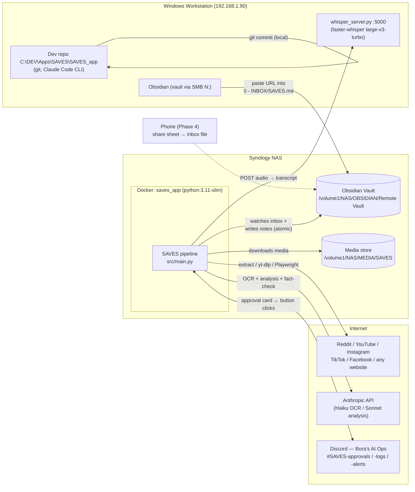
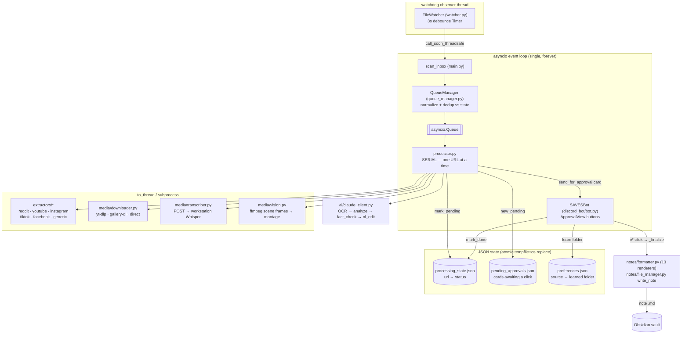
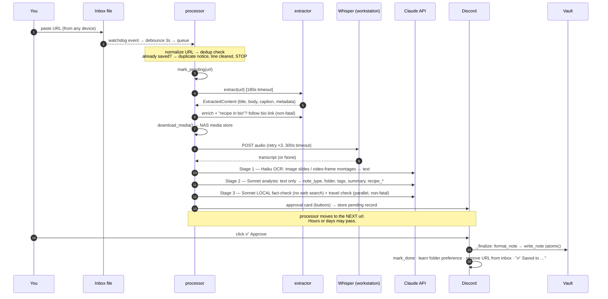
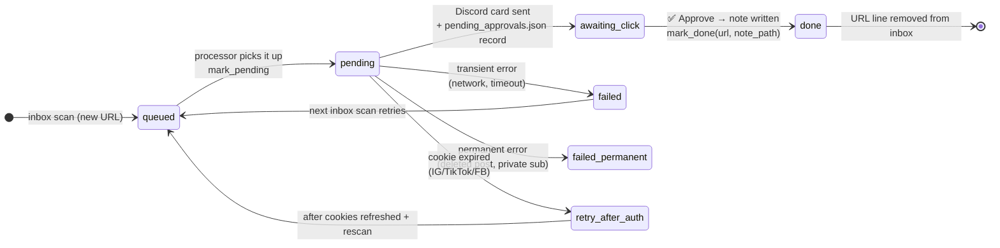

# SAVES — Architecture & Operations Reference

> **What this doc is:** the "how this system is designed and works" reference — diagrams,
> lifecycles, commands, and the knobs you'll actually touch — written to be useful six months
> from now when none of this is fresh.
>
> **Doc map:** `CLAUDE.md` = orientation (auto-loaded each session) · `docs/HANDBOOK.md` =
> recreate & maintain (full config reference in §8, runbook in §9) · `docs/ROADMAP.md` = where
> we are · `docs/PLAN.md` = why decisions were made · `docs/CODE_REVIEW_2026-07-04.md` =
> pre-PROD findings · **this file** = how it's built and how to drive it.
>
> Diagrams are Mermaid — they render on GitHub and in Obsidian; in a terminal read the labels.

---

## 1. Bird's-eye view — the machines and what talks to what

Three physical places: your **Windows workstation** (dev + Whisper + Obsidian), the
**Synology NAS** (the app's real home, in Docker), and **the internet** (content platforms,
Anthropic, Discord). One human surface: Discord on any device.



**The core idea:** you paste a URL into one Markdown file from anywhere; hours later you tap
✅ in Discord and a fully-formed note (media downloaded, transcribed, OCR'd, summarized,
fact-checked, filed into the right folder) exists in your vault. The pipeline never writes a
note without your approval, and it never deletes anything, ever.

---

## 2. Inside the container — runtime components

Two threads only: **watchdog's observer thread** (filesystem events) and the **main asyncio
event loop** (everything else). Blocking work (yt-dlp, HTTP, ffmpeg) is pushed to worker
threads via `asyncio.to_thread`; the loop itself stays free so Discord heartbeats never miss.



Key structural facts:

- **The processor never writes notes.** It ends its job by posting the Discord card. The
  bot's button handler (`_finalize`) is the *only* code path that writes a note. This is why
  a crash mid-pipeline can never produce a half-written note.
- **Serial by design.** One URL at a time keeps yt-dlp, Playwright, and API costs predictable
  and makes every log linear. The queue absorbs bursts.
- **Everything critical survives a restart** via the three JSON files: unfinished URLs are
  found again by the startup inbox scan, pending cards get their buttons re-armed
  (`add_view(view, message_id=…)`), and folder preferences persist.

---

## 3. The pipeline, step by step (sequence)



**Model routing (the cost design):**

| Stage | Model | Input | Why |
|---|---|---|---|
| 1 · OCR | `claude-haiku-4-5` | images / frame montages | cheap eyes — turns pixels into text once |
| 2 · Analysis | `claude-sonnet-4-6` (effort: medium) | text only (incl. OCR text) | no image tokens twice; A/B showed Sonnet ≈ Opus at ~½ cost |
| 3 · Fact-check (on arrival) | `claude-sonnet-4-6` | text only, **no web search** | cheap flags: conflicts of interest, dosage/safety, authenticity |
| 3b · Deep fact-check (🔍 button only) | `claude-sonnet-4-6` + web search | on demand | caps: health 6 · finance 3 · political 1 searches; recipes never web-search |

Prompt caching keeps the big static system prompt at ~10% cost after the first call.
Vision is skipped entirely for `generic` web (text already extracted) and YouTube
(only a thumbnail exists; Shorts are the exception).

---

## 4. URL lifecycle — the state machine

Every URL's fate lives in `processing_state.json`, keyed by the **normalized** URL
(tracking params like `igsh`/`fbclid`/`utm_*` stripped — so re-sharing the same post from a
different app still dedups).



What each status means when you're staring at the JSON:

| status | Meaning | What happens next |
|---|---|---|
| `pending` | Pipeline started (or card is awaiting your click) | Nothing re-runs it — it's "in flight" |
| `done` | Note written; `path` records where | Re-pasting the URL → duplicate notice, no tokens spent |
| `failed` | Transient failure, `reason` says why | Re-enqueued automatically on the next inbox scan |
| `failed_permanent` | Unfixable (deleted post, etc.) | Never retried; alert was sent |
| `retry_after_auth` | Cookies were expired | Refresh cookies, it retries on next scan |

> ⚠️ **Known gap (review finding #3):** a crash *between* `mark_pending` and the Discord card
> leaves a `pending` orphan that never retries. Until the startup-reconciliation fix lands:
> if a URL vanished without a card, edit its entry out of `processing_state.json` (or set
> status to `failed`) and touch the inbox file.

The **approval card record** (`pending_approvals.json`) carries everything `_finalize` needs
so approval works even days later, after restarts: `id`, `url`, `platform`, `ai_result`
(the full analysis JSON), `content_summary`, `media_paths`, `transcript`,
`discord_message_id`, `created_at`.

---

## 5. Threading & async model — the two invariants

```
OS thread: watchdog Observer          asyncio event loop (the only loop)
────────────────────────────          ────────────────────────────────────
inbox file modified                   │
  └─ on_modified()                    │
      └─ Timer(3s) debounce           │
          └─ call_soon_threadsafe ──► scan_inbox() → queue → processor → bot
                                      │
                                      ├─ blocking work? → asyncio.to_thread(...)
                                      │    (yt-dlp, requests, ffmpeg, gallery-dl)
                                      └─ Playwright → native async API
```

1. **Single event loop, forever.** Nothing may call `asyncio.run()` while the loop runs, and
   no second loop may exist. The watchdog thread is the only other thread, and it touches the
   loop exclusively through `call_soon_threadsafe`.
2. **Zero delete calls.** No `os.remove` / `os.unlink` / `shutil.rmtree` / `Path.unlink`
   anywhere. Atomic writes = `tempfile.mkstemp` in the destination dir + `os.replace`.
   Failed writes orphan a `.tmp` file (harmless, left in place). Cross-volume moves rename
   the source to `.bak`. Verify anytime:
   ```
   grep -rn "os.remove\|os.unlink\|shutil.rmtree\|\.unlink(" src/ scripts/
   ```

---

## 6. Storage map — what lives where

| Thing | Location | Notes |
|---|---|---|
| Inbox (the one file you write) | `{vault}/0 - INBOX/SAVES.md` | one URL per line; lines are removed only after approval or duplicate-notice |
| Notes | `{vault}/SAVES/<AI-chosen folder>/<title>.md` | atomic write; never overwrites (name collision → `-2` suffix) |
| Media | `{media_root}/{platform}/{author}/{slug}/` | videos, images, subtitles; notes embed via vault-relative paths |
| Processing state | `processing_state.json` (repo/app root) | §4 above |
| Pending approvals | `pending_approvals.json` | cards awaiting clicks; survives restarts |
| Learned folders | `preferences.json` | source-key → folder; written on every approval |
| Cookies | `cookies/instagram.txt`, `tiktok.txt`, `facebook.txt` | gitignored; expiry monitored → `#SAVES-alerts` |
| Logs | `logs/processor.log` (all), `logs/errors.log` (errors only) | append-only by design |

**Preference source keys** (how the folder-learning is keyed):
`reddit:r/{subreddit}` · `youtube:{channel}` · `instagram:{handle}` · `tiktok:{handle}` ·
`facebook:{handle}` · `domain:{hostname}` (generic web). On a new save the stored folder is
injected into Claude's prompt as a hint; your approval (including any path change) writes the
final folder back. The system literally learns your filing habits per source.

---

## 7. Discord surface — every button explained

Channels: `#SAVES-approvals` (cards), `#SAVES-logs` (successes, duplicates), `#SAVES-alerts`
(failures, cookie expiry).

| Button | What it does |
|---|---|
| ✅ **Approve** | Writes the note, learns the folder preference, marks done, removes the inbox line |
| 📁 **Change Path** | Modal → new folder path → that path is what gets learned on approve |
| 🏷️ **Edit Tags** | Modal with `+add -remove` syntax |
| 🗑️ **Remove Tags** | Quick tag removal |
| ✏️ **NL Edit** | Type instructions in plain English ("move to COOKING/BBQ and retitle …") — a second Claude call parses it into a structured edit; then click Approve |
| 🔍 **Deep fact-check** | The *only* trigger for web-searched fact-checking (health 6 / finance 3 / political 1 searches) — updates the card with findings |
| ⚠️ **Approve + Include Warning** | Appears only when the local fact-check or travel check disputed something; writes the note with a `> [!warning]` callout embedded |

`auto_approve_on_timeout` exists in config (default **off**) — if ever enabled, unclicked
cards self-approve after `auto_approve_timeout_hours` (48).

---

## 8. Command reference (the cheat sheet)

All run from the repo root, `C:\DEV\Apps\SAVES\SAVES_app`, with `.env` present
(`ANTHROPIC_API_KEY`, `DISCORD_BOT_TOKEN` — the only two secrets in the whole system).

### Daily driving

| Command | What it does |
|---|---|
| `python src\main.py` | The whole app: watcher + processor + Discord bot. Ctrl-C to stop. |
| `python scripts\process_one.py "<url>"` | Full pipeline for ONE url, **writes the note** — the main test tool |
| `python scripts\process_one.py "<url>" --dry-run` | Same but prints the note instead of writing — no vault touch |
| `python scripts\process_one.py "<url>" --deep` | Also runs the web-searched fact-check (normally button-only) |
| `python scripts\test_connection.py` | Smoke test: Anthropic key, Discord token, Reddit reachability |
| `/save <url>` (in Claude Code) | Skill: runs process_one dry-run → auto-QA → asks → writes + commits |

### Whisper (workstation — must be running for any video/audio save)

```powershell
python scripts\whisper_server.py --model large-v3-turbo
# defaults: --host 0.0.0.0  --port 5000  --device cpu  --compute-type int8  --language auto
# verify:   curl http://192.168.1.90:5000/health
```
Full runbook incl. firewall + auto-start options: **HANDBOOK §9.1**.

### Docker (NAS)

```bash
cd docker/
docker-compose up --build -d     # build + start (fix review blockers #1–2 FIRST)
docker-compose logs -f            # tail the app
docker-compose restart            # bounce after config.yaml change (config is read at startup)
docker-compose down               # stop (state/notes/media all live outside the container)
```

### Maintenance & QA

| Command | What it does |
|---|---|
| `ruff check src scripts` | Lint (config in `pyproject.toml`) |
| `python scripts\test_phase2.py` (and the other `scripts\test_*.py`) | **No-token** unit tests: caption restore, nutrition merge, offsite detection, media paths, html→md, TikTok photo/caption, bio-recipe section |
| `python scripts\ab_compare.py "<url>"` | Writes two labeled notes (model A/B) into the DEV vault for side-by-side judging |
| `python scripts\refresh_cookies.py` | Prints the cookie re-export walkthrough ("Get cookies.txt LOCALLY" extension → `cookies/*.txt`) |
| `python scripts\diag_imgs.py` | Image-extraction diagnostics for a problem page |

### Git (the workflow that keeps us out of trouble)

- Claude **commits locally; you push** — always your manual step.
- Patches (when delivered instead of direct edits): `git apply patches\name.patch` (never
  `git am`), filenames underscores-only with the base SHA:
  `saves_<topic>__base_<shortsha>.patch` — check `git rev-parse --short HEAD` matches before
  applying. Full protocol: **CLAUDE.md → Git Workflow**.

---

## 9. Configuration — the knobs you'll actually touch

The **complete** key-by-key reference is **HANDBOOK §8**. This is the short list, grouped by
"why you'd be here":

| You want to… | Key (config.yaml) | Notes |
|---|---|---|
| Change the analysis brain | `ai.model` | currently `claude-sonnet-4-6` (A/B beat Opus on cost) |
| Make analysis think harder/cheaper | `ai.effort` | `low` / `medium` / `high`; Haiku OCR auto-skips it |
| Spend less on images | `vision.max_images`, `vision.max_video_frames`, `vision.frame_grid` | 2×2 montage = 4 frames for 1 image's tokens |
| Catch more/fewer video captions | `vision.frame_scene_threshold` | lower = more frames (0.3 default) |
| Rein in fact-check cost | `fact_checking.max_searches_by_topic` | health 6 / finance 3 / political 1 |
| Point at a different Whisper box | `transcription.remote_url` | mode stays `"remote"`; `"local"` runs faster-whisper in-process |
| Skip huge videos | `transcription.max_duration_minutes` | ⚠️ currently only enforced in local mode (review #11) |
| Extraction hangs? | `processing.extract_timeout_seconds` | hard cap per URL (180) |
| Stop bio-link following | `processing.follow_profile_recipes` | default on, non-fatal |
| Turn off duplicate notices | `processing.skip_duplicates` | default on |
| Cookie-expiry alert timing | `platforms.<x>.cookie_expiry_days` / `cookie_warning_days_ahead` | IG/TikTok 21d, FB 30d |
| Rename Discord channels | `discord.channel_approvals` / `channel_log` / `channel_alerts` | must match server channel names |
| Move the vault/inbox | `paths.*` | container paths — must agree with docker-compose mounts (review #1) |

Environment (`.env` — the only secrets): `ANTHROPIC_API_KEY`, `DISCORD_BOT_TOKEN`.
Reddit needs **no** credentials (public JSON API). Config is loaded once at startup —
restart the app/container after edits.

> Keys that exist but are currently **unwired** (don't expect them to do anything):
> `ai.max_content_chars`, `watcher.debounce_seconds`, `processing.concurrent_downloads`,
> `media.download_video/download_images` (global — the YouTube one *does* work),
> `notes.tags_min/max`, `transcription.skip_if_captions_available`.
> Details: CODE_REVIEW_2026-07-04.md → unused-config table.

---

## 10. Things to never forget (the gotcha list)

1. **Zero deletes / single loop** — the two hard constraints (§5). Every code change is
   checked against them.
2. **Only the bot writes notes.** If a note didn't appear, the question is "was ✅ clicked
   and did `_finalize` succeed?" — not "did the processor fail?".
3. **The mounts must mirror `config.yaml` paths** in Docker — as shipped they don't
   (review blockers #1–2). Fix before first `docker-compose up`.
4. **URL keys are normalized.** When hand-inspecting `processing_state.json`, strip tracking
   params from the URL you're looking for.
5. **Cookies expire ~monthly.** IG/TikTok/FB saves failing with auth errors →
   `python scripts\refresh_cookies.py` and re-export; the URL retries automatically
   (`retry_after_auth`).
6. **Whisper must be up** on the workstation for any video/audio save, or transcripts are
   silently `None` (the save still completes — just without a transcript).
7. **Windows consoles are cp1252** — all CLI scripts force UTF-8 themselves; if you write a
   new script that prints emoji, copy the `sys.stdout.reconfigure(encoding="utf-8")` header
   from `process_one.py`.
8. **config.yaml is read once at startup** — restart after every edit.
9. **Notes never overwrite** — re-approving a URL that's already `done` short-circuits with
   "Already saved"; a genuinely re-saved item gets a `-2` filename.
10. **Recipes are injected everywhere** — any note type with `recipe_*` fields gets the
    styled Recipe section (nutrition label, unit conversions, translation); that's by design,
    not a `web_recipe` bug.
